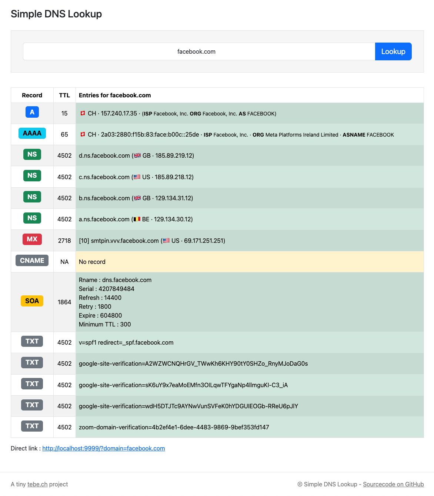

# Simple DNS Lookup

Simple PHP script for looking up A, AAAA, NS, MX, CNAME, SOA and TXT DNS records. Quickly created with PHP 8.3 and Bootstrap 5.

You can test the tool here: https://simple-dns-lookup.tebe.ch/

